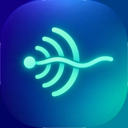
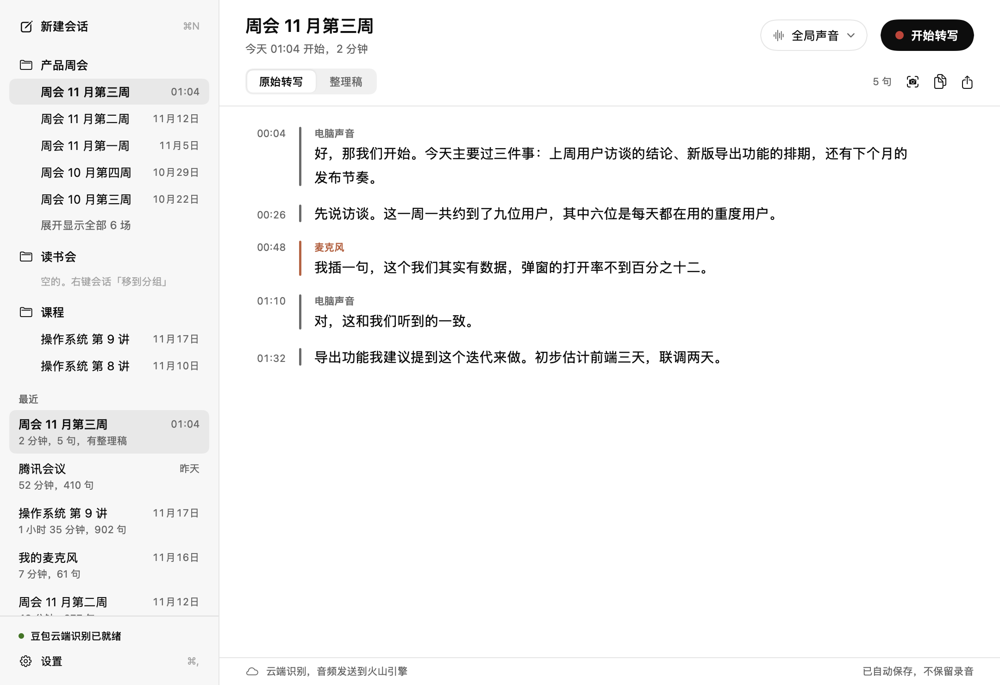
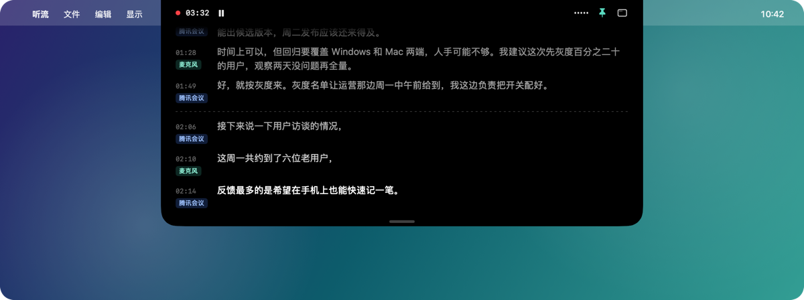
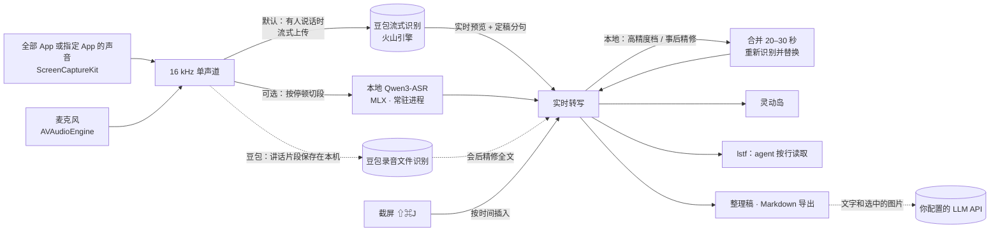

<div align="center">



# 听流 · ListenFlow

**把会议、网课和线下课堂的声音，在你自己的 Mac 上实时变成文字。**

截屏跟着时间存进记录，会后一键整理成稿，你的 agent 能直接读。默认用豆包云端流式识别，边说边出字；也可以切到本地模型，语音不出本机。

[](#安装)
[](#安装)
[](outputs/ListenFlow/Sources)
[](#它是怎么工作的)
[](#更新记录)

[安装](#安装) · [详细手册](outputs/ListenFlow/README.md) · [更新记录](#更新记录) · [实测记录](outputs/ListenFlow/TESTING.md)

</div>

<br>

<p align="center">
  
</p>

<p align="center"><sub>截图中的会议内容和幻灯片都是演示用的虚构数据。</sub></p>

## 亮点

<table>
<tr>
<td width="50%" valign="top">

### 🎧 打开就录，也可以只听一个 App
默认「全局」：电脑上所有 App 的声音和麦克风一起录，线上会议里对方和你说的话都有，每句标出来源；外放时麦克风录到的回声会自动去掉。只想听腾讯会议或某个播放器时选「指定 App」，提示音、其他窗口的视频不会混进来。线下场景切到麦克风。

</td>
<td width="50%" valign="top">

### ☁️ 云端出字快，本地不出本机
默认用火山引擎豆包流式识别：说话不到 1 秒就出字，一句说完由服务端再识别一遍定稿。这时**音频会发送到火山引擎**。想让语音留在本机或没有网络时，在设置里切到本地 Qwen3-ASR 1.7B（MLX，Apple Silicon）。

</td>
</tr>
<tr>
<td valign="top">

### ✂️ 在停顿处切，而不是硬切
本地模型按滚动底噪判断讲话的间隙，只看 200 Hz 以上的能量，空调、风扇的低频嗡声不会让它误判。豆包引擎由服务端断句，同一套判断只用来决定什么时候有人说话：静音不上传、不计费。

</td>
<td valign="top">

### 🔁 先出字，再变准
豆包引擎自带二遍识别：灰色预览先出，句子结束后换成定稿。本地模型的高精度档先实时出短片段，再把约 20 秒的内容合起来重新识别、整行替换。会后点「精修全文」再过一遍整场：豆包引擎把保存的录音交给录音文件识别，本地模型按 30 秒一段在本机重识别。

</td>
</tr>
<tr>
<td valign="top">

### 📸 截屏跟着时间走，会后成稿
按 `⇧⌘J`（或点灵动岛上的按钮）截下整个屏幕，图片按时间插在转写中间：这页幻灯片是讲到哪一句时出现的，回看和让 agent 读的时候都一目了然。位置不对可以把图拖到别的段落前后，多截的可以单张删掉。整理稿把碎片化转写合成连贯段落，增量更新，已定稿的部分不会被改写。

</td>
<td valign="top">

### 🏝️ 刘海灵动岛
鼠标移到刘海，最近的转写从屏幕顶部展开；可以固定展开，高度从一行拖到大半个屏幕，宽度在设置里调。**不会出现在屏幕共享和截图里**，共享屏幕时别人看不到你在转写什么。

</td>
</tr>
<tr>
<td valign="top">

### 🤖 让你的 agent 也听得到
`lstf` 命令让 Claude Code、Codex 这类 agent 读到正在录的这场会和所有历史会话：像读文件一样按行号翻页，截屏的图片路径按时间夹在句子中间，可以搜索，可以拿着你复制给它的会话 ID 直接找到那一场（`lstf info`），或者只读你右键点过的那一段，可以给会话改名，可以看分组、建分组、把会话归到分组，可以对还没精修的会话启动精修，还可以自己写一份整理稿存回这场会话；不能删除会话。说一句「`lstf --help` 查一下刚才会上定的截止时间」，它读完帮助就知道怎么取。不能替你开始或停止录制。

</td>
<td valign="top">

### 🔤 热词：人名和术语的正确写法
把容易被认成同音字的人名、产品名、术语加进热词表，识别时优先往这些词上靠。在设置里增删，或者让 agent 用 `lstf hotword add` 当场加上；录制中改了，从下一段讲话起生效。已经在火山引擎控制台建过热词表的，也可以填它的 ID。

</td>
</tr>
</table>

## 刘海灵动岛

<p align="center">
  
</p>

- 收起时什么都不显示，也不挡鼠标；可选「收起时常亮显示最新一句」。
- 最新一句最亮，越早越淡；虚线以下是还没合并重识别的实时片段。
- 展开后右上角有截屏按钮（上图是加这个按钮之前截的）。
- 拖底部的小横条调高度，最矮只留一行，松手后记住。
- 宽度在设置里调，最窄到刘海两侧刚好排得下计时和按钮（14 寸屏约 425 pt），最宽 1100 pt；没有刘海的屏幕显示在顶部正中。

## 它是怎么工作的


```mermaid
flowchart LR
    A["全部 App 或指定 App 的声音<br/>ScreenCaptureKit"] --> C
    B["麦克风<br/>AVAudioEngine"] --> C
    C["16 kHz 单声道"] -->|"默认：有人说话时<br/>流式上传"| V[("豆包流式识别<br/>火山引擎")]
    V -->|"实时预览 + 定稿分句"| E["实时转写"]
    C -->|"可选：按停顿切段"| D["本地 Qwen3-ASR<br/>MLX · 常驻进程"]
    D --> E
    E -->|"本地：高精度档 / 事后精修"| F["合并 20–30 秒<br/>重新识别并替换"]
    F --> E
    C -.->|"豆包：讲话片段保存在本机"| R[("豆包录音文件识别")]
    R -.->|"会后精修全文"| E
    E --> G["灵动岛"]
    S["截屏 ⇧⌘J"] -->|"按时间插入"| E
    E --> H["lstf：agent 按行读取"]
    E --> I["整理稿 · Markdown 导出"]
    I -.->|"文字和选中的图片"| J[("你配置的 LLM API")]
```

### 实测

豆包引擎（30 秒讲课式语音经真实 app 流程回放）：开始说话后约 0.8 秒出现第一段预览，句子结束后约 0.5 秒定稿；暂停时正在说的半句不丢；连接中途断开会自动重连并补发未定稿的音频。

豆包引擎会后「精修全文」（269 秒带底噪语音，1322 字，单次测试）：实时结果错 27 个字，精修后 21 个；实时结果里被服务端每 20 秒强制切开的长句，精修后按语义重新断句。上传后约 29 秒返回。

本地模型：2224 字中文语音、带底噪，经真实 app 流程回放，统计错字数（越少越好）：

| 方案 | 有底噪 | 快语速、几乎无停顿 |
| --- | ---: | ---: |
| 早期版本：固定 4 秒硬切 | 121 | 127 |
| **省电**：在停顿处切，每段识别一次 | 72 | 90 |
| **高精度**：实时出字 + 约 20 秒合并重识别 | **58** | **59** |
| 省电录完 → **事后精修**（30 秒窗口） | 67 | 60 |

省电档约占 7.5% 的 GPU 时间，高精度约 13%。「自动」档接电源时用高精度，用电池或低电量模式时用省电。测试方法和更多数据见 [TESTING.md](outputs/ListenFlow/TESTING.md)。

## 安装

> 需要 Apple Silicon（M1 及以后）的 Mac，macOS 15 或更新。

1. （只在要用本地模型时需要）**准备识别环境**并下载模型（约 2 GB）：

   ```sh
   python3.12 -m venv ~/listenflow-venv
   ~/listenflow-venv/bin/pip install mlx-audio
   ~/listenflow-venv/bin/python -c "from mlx_audio.stt.utils import load_model; load_model('mlx-community/Qwen3-ASR-1.7B-8bit')"
   ```

2. **从源码构建当前版本**（需要 Swift Command Line Tools：`xcode-select --install`）：

   ```sh
   git clone https://github.com/starsalwaysineyes/listenflow.git
   cd listenflow/outputs/ListenFlow
   LISTENFLOW_APP_DIR=/Applications/ListenFlow.app ./build.sh
   ```

   本机构建、临时签名，不需要解除隔离。之后更新：`git pull` 再运行同一条构建命令，退出听流后重新打开。
3. 不想编译的话，[Releases](https://github.com/starsalwaysineyes/listenflow/releases/latest) 里有现成的安装包，但**停在 0.7.2**（2026-10-21）：只有本地模型和灵动岛，没有豆包引擎、截屏、`lstf` 和之后的所有功能，下面第 4 步里的引擎选择也不适用。那一版没有经过 Apple 公证，第一次打开前要执行 `xattr -dr com.apple.quarantine /Applications/ListenFlow.app`。

4. 打开听流 →「设置」（`⌘,`），选识别引擎：
   - **豆包（云端，默认）**：填入火山引擎豆包语音的 API Key；资源 ID 默认是流式识别 2.0 小时版 `volc.seedasr.sauc.duration`，按送入的音频时长计费。会后「精修全文」用的是录音文件识别（`volc.seedasr.auc`，同一个 Key，另外计费），两项都要在控制台开通。
   - **本地模型**：把 Python 路径填成 `~/listenflow-venv/bin/python` 的完整路径，等左下角出现「本地模型已就绪」。
5. 第一次转写时按提示允许「屏幕与系统音频录制」和「麦克风」。
6. 想用整理稿，再填一个兼容 `chat/completions` 的 API（默认 DeepSeek）。只做转写可以不填。
7. （可选）想让 agent 读转写：有 `~/.local/bin` 这个目录时，构建脚本已经把 `lstf` 链接进去了；没有的话自己链接到 PATH 里的某个目录，`ln -s /Applications/ListenFlow.app/Contents/MacOS/lstf <目录>/lstf`。然后 `lstf --help`。

## 使用

| 场景 | 做法 |
| --- | --- |
| 腾讯会议、网课 | 用默认的「全局」，直接开始转写；只想听一个 App 时选「指定 App」 |
| 线下课堂、线下会议 | 来源选「我的麦克风」，`⌥⌘R` 开始 |
| 全局声音下暂时不录自己这边 | 点右上角圆形的麦克风按钮；开始前、录制中都可以关，再点一下恢复 |
| 想记下板书或 PPT | `⇧⌘J` 截下整个屏幕，图片按时间存进这场会话 |
| 截屏的位置不对，或者多截了 | 把图拖到对应的段落前后；鼠标移到图上点 ✕ 删掉这一张，删错了点提示条上的「撤销」或按 `⌘Z` |
| 找某句话是哪场会上说的 | 在列表上方的「搜索全部会话」里输入，点结果跳到那一句；只在当前这一场里找按 `⌘F` |
| 人名、术语总是识别错 | 设置最上面的热词表里加上正确的写法 |
| 会后 | 「精修全文」重识别 →「整理稿」成稿 → 导出 Markdown |
| 把同一类的会放在一起 | 在会话上右键「移到分组」；分组显示在列表上方，会话同时还在「最近」里。也可以让 agent 用 `lstf group move 分组名` |
| 会话名太长看不全 | 左右拖动列表和正文中间的分隔线；双击回到默认宽度 |
| 给一场会起个好找的名字 | 点主窗口顶部的会话名直接改，或在列表里右键「改名…」；也可以让 agent 用 `lstf rename 新名字`。填了整理稿模型的 API Key 时，暂停后会自动起一个（可在设置里关掉） |
| 删掉一场不要的会话 | 在列表里右键「删除…」；文件进废纸篓，它的录音直接删除 |
| 让 agent 来写整理稿 | 对它说「用 `lstf` 把这场会整理成稿存回去」；它读完转写，写好后用 `lstf draft write` 存进会话，「整理稿」页里就能看到 |
| 把某一场历史会话交给 agent | 在会话上右键「复制给 agent 的命令」，贴给它：剪贴板里是一行 `lstf info <会话 ID>` |
| 只问 agent 其中一段 | 在正文的那一段上右键「复制给 agent 的命令」：一行 `lstf read <会话 ID> --offset N --limit M`，正好是这一段 |
| 把别处的图放进会话 | 复制图片后在听流窗口里按 `⌘V`；之后可以拖到对应的段落旁边 |
| 让 agent 用会议内容 | 对它说「`lstf --help`，然后……」；常用的是 `lstf read --minutes 5`、`lstf list`、`lstf search 关键词` |

| 快捷键 | 作用 |
| --- | --- |
| `⌥⌘R` | 全局：开始 / 暂停转写 |
| `⇧⌘J` | 全局：截下鼠标所在的整个屏幕，存进当前会话 |
| `⌘V` | 窗口内：剪贴板里是图片时，贴进当前会话 |
| `⌘F` | 窗口内：在打开的这场会话里查找 |
| `⌘Z` | 窗口内：刚删掉一张图时，把它放回原处 |
| `⌘N` / `⌘,` | 新会话 / 设置 |

关掉主窗口不会停止录音，菜单栏图标常驻，本身就是录制状态指示。

## 隐私

- **音频**：取决于识别引擎，界面左下角和底栏始终标明当前是哪一种。
  - 豆包（默认）：有人说话时，音频实时发送到火山引擎识别；静音不发送。「保存录音」开启时（默认），发出去的这部分音频同时保存在本机，会后点「精修全文」会再上传一次。关闭后不在本机保存音频。
  - 本地模型：只在本机识别，音频不离开这台 Mac。「保存录音」开启时会在本机保存 16 kHz 音频用于精修。
  - 录音都在 `~/.listenflow/audio/`，只有本人可读。**精修后不删除**，一直留到你删除那场会话，以后换了更好的模型还能重新识别；每一路声音每小时讲话约 115 MB，设置里能看到总占用。可以随时手动删除。
- **文字**：会话保存在 `~/Library/Application Support/ListenFlow/`；只在两种时候发送给你配置的 API：生成整理稿时，以及暂停后给还没起名的会话起名时（只发开头约 1500 字，默认开启，可在设置里关掉；没有填 API Key 时不发）。
- **截屏**：只保存在本机（同一目录下的 `Images/<会话 ID>/`，只有本人可读），截的是整个屏幕，听流自己的窗口不在其中；粘贴进来的图片也存在这里。单张删除的图片在撤销的机会过去之后进废纸篓。只有你把某张图选作整理稿的参考图片时，它才随整理发送给你配置的 API。
- **热词**：保存在 `~/.listenflow/hotwords.txt`。豆包引擎下随识别请求发送到火山引擎。
- **密钥**：保存在 `~/.listenflow/keys.json`，明文，只有本人可读（文件权限 0600）。不使用钥匙串；旧版存在钥匙串里的密钥会在第一次用到时移到这个文件。
- **灵动岛**：不进入屏幕共享和截图。

## 从源码构建

```sh
git clone https://github.com/starsalwaysineyes/listenflow.git
cd listenflow/outputs/ListenFlow
./build.sh        # 产物是 outputs/听流.app；用 LISTENFLOW_APP_DIR 指定别的位置
```

只依赖系统框架（SwiftUI、ScreenCaptureKit、AVFoundation、IOKit），无第三方 Swift 包。需要 Swift Command Line Tools。测试命令见[详细手册](outputs/ListenFlow/README.md#测试)。

<details>
<summary><b>项目结构</b></summary>

```
outputs/ListenFlow/
├── Sources/
│   ├── CaptureEngine.swift     全部 App / 指定 App 音频 + 麦克风采集，转 16 kHz 单声道
│   ├── AudioChunker.swift      滚动底噪 + 200 Hz 高通，在停顿处切段
│   ├── Recognition.swift       识别档位、录音的保存、精修窗口与替换
│   ├── VolcProtocol.swift      豆包流式识别的帧编解码、分句去重、补发缓存、说话检测
│   ├── VolcStream.swift        每个音频来源一条豆包连接：流式上传、重连、收尾
│   ├── VolcFile.swift          豆包录音文件识别：会后把保存的录音分段上传，替换实时结果
│   ├── ASRBridge.swift         与本地 Python 识别进程的 JSON lines 管道
│   ├── NotchIsland.swift       刘海灵动岛
│   ├── ScreenshotCapture.swift 截下整个屏幕（不含听流自己的窗口）
│   ├── ImageAttachments.swift  截屏和图片的存储
│   ├── LLMClient.swift         整理稿的模型请求
│   ├── Storage.swift           设置、密钥文件、热词表、会话、后台存盘、正文合段与导出
│   ├── AgentBridge.swift       app 与 lstf 之间的状态文件和请求文件
│   └── AppModel.swift / ContentView.swift / SettingsView.swift
├── CLI/                        lstf 命令：给 agent 读转写用（随 app 一起构建，装在 app 包里）
├── Backend/asr_worker.py       常驻 MLX 模型
├── Tests/                      核心逻辑、整理与识别进程测试
└── build.sh
work/asr-lab/                   切分与精修方案的对比实验脚本
```

</details>

## 已知限制

- 外放声音时开着麦克风，回声按文字去重（同一时段两路内容重合就只留 App 那句）；你和对方同时说话时，偶尔仍会混进对方的几个字，戴耳机最干净。
- 区分「App / 电脑声音」和「麦克风」两路来源，不区分会议里的不同讲话人。
- 「全局」会录下电脑上的一切声音，包括提示音和背景音乐；豆包引擎下这些也会上传并计费。
- 远场收音（讲话只比底噪高约 10 dB）时，本地模型的错字明显多于近距离收音，麦克风靠近说话人最有效。豆包引擎在这种音量下和正常电平差不多（合成语音加真实底噪测的，没有做降噪和提音量）；但整体音量极低时，听流判断不出有人说话，这一段不会被识别。
- 准确率数据来自合成语音加底噪；多人插话、背景音乐、口音等情况还需要更多实测。
- 豆包引擎需要网络和可用的账户额度；连续几小时的真实课堂、两路同时长时间识别还没有实测。豆包的「精修全文」最长只用 4.5 分钟的录音测过。
- 最近几版的界面功能（`⌘F` 查找、`⌘Z` 撤销删图、段落上的右键菜单、`⌘V` 粘贴图片、复制会话 ID、单张删除截屏、全局声音下先关麦克风）逻辑上有自动检查，但没有逐项在真实窗口里验证过；暂停后自动起名只对着模拟的模型服务测过；多显示器下的截屏、录制中途改热词的效果也还没有实测。逐条见[详细手册](outputs/ListenFlow/README.md#当前边界)。
- Releases 里的安装包停在 0.7.2，当前版本要从源码构建。
- 只在两台 MacBook Pro 上用过：16 寸 M1 Max 和 14 寸 M4。

## 更新记录

版本号后面是提交到仓库的日期。每一版测了什么、没测什么，见[实测记录](outputs/ListenFlow/TESTING.md)。

### 0.16.0 · 2026-11-19
- 窗口里可以搜索：列表上方的输入框搜全部会话，点结果跳到那一句；`⌘F` 在打开的这一场里查找。
- 在正文的一段上右键，复制一行正好读出这一段的 `lstf read` 命令，交给 agent。
- 删掉的截屏可以撤销：点提示条上的「撤销」或按 `⌘Z`，图回到原处。
- 暂停后自动给还没起名的会话起名：把开头的转写文字发给整理稿用的模型（没有填 API Key 时不做，设置里可以关）。
- 会话结束以后才放进来的图不再显示一个离谱的时间，标着「后加」；`lstf read` 里是 `[后加]`。

### 0.15.0 · 2026-11-19
- 会话可以直接交给 agent：在会话上右键复制一行 `lstf info <会话 ID>`，或只复制会话 ID。
- 新命令 `lstf info`：一场会话的概况和接着怎么读，不带转写内容。
- 在主窗口里按 `⌘V`，剪贴板里的图片存进当前会话。

### 0.14.x · 2026-11-19
- 0.14.1：`lstf read` 标出用户挪过位置的图，agent 按位置理解它讲的是哪一段。
- 0.14.0：正文里的截屏可以拖到别的段落前后，右键可以一格一格挪、放回原处；可以单张删除。

### 0.13.x · 2026-11-19
- 0.13.3：灵动岛展开后最矮可以拖到只剩一行。
- 0.13.2：灵动岛的宽度可以调得更窄。
- 0.13.1：全局声音下可以先把麦克风关掉，只录电脑上的声音；底色改为纯白，电脑声音用青绿色、麦克风用陶土色。
- 0.13.0：主窗口换了配色：白底、中性的墨色文字。

### 0.12.x · 2026-11-19
- 0.12.1：会话列表可以拖宽；分组可以先建好再放会话；`lstf group` 看分组、建分组、把会话归到分组。
- 0.12.0：会话列表分成上面的分组和下面的「最近」，一场会话可以同时在两处。

### 0.11.x · 2026-11-19
- 0.11.4：录音在精修之后保留，不再自动删除，以后换了模型还能重新识别。
- 0.11.3：agent 可以写整理稿存回会话（`lstf draft write`）。
- 0.11.2：会话可以在窗口里删除。
- 0.11.1：会话可以改名，窗口里或用 `lstf rename`。
- 0.11.0：新的主窗口；`⇧⌘J` 截下整个屏幕，按时间存进会话；热词表。窗口里的问答栏去掉了，改由 agent 通过 `lstf` 读转写来回答。

### 0.10.x · 2026-11-18
- 0.10.1：精修后的转写按段落显示，不再一句一行。
- 0.10.0：`lstf` 命令行工具，agent 可以读正在录的这一场和所有历史会话。

### 0.9.x · 2026-11-18
- 0.9.1：默认录「全局」：电脑上所有 App 的声音加麦克风，不用先选 App。
- 0.9.0：豆包引擎下会后可以「精修全文」，把保存的录音交给录音文件识别再过一遍。密钥从钥匙串改存 `~/.listenflow/keys.json`。

### 0.8.0 · 2026-11-18
- 豆包流式识别成为默认引擎，边说边出字；本地模型仍可在设置里选。

<details>
<summary><b>0.7 及更早</b></summary>

### 0.7.x · 2026-10-21
- 0.7.3：外放时麦克风录到的回声自动去掉。
- 0.7.2：灵动岛的宽度可以在设置里调。**Releases 里现成的安装包是这一版。**
- 0.7.1：灵动岛的高度可以拖动。
- 0.7.0：刘海灵动岛显示实时转写。

### 0.6.x · 2026-10-12 至 10-19
- 0.6.2：低音量、远场收音时的切段优化；实时片段和已合并的内容之间加一条虚线。
- 0.6.0：在停顿处切段，不再固定 4 秒硬切；识别档位（省电 / 高精度 / 自动）；会后精修全文。

### 0.5.0 · 2026-10-12
- 来源可以只选麦克风，不用先选一个 App。
- 菜单栏常驻图标；全局快捷键 `⌥⌘R` 开始 / 暂停。
- 整理稿增量更新：已经定稿的段落不再重写。

### 0.4.1 · 2026-10-11
- 应用图标；项目开始用 git 管理，更早的版本没有记录。

</details>

## 致谢

- [豆包流式语音识别](https://www.volcengine.com/docs/6561/1354869)与[录音文件识别](https://www.volcengine.com/docs/6561/1354868)（火山引擎）：默认的云端识别与会后精修
- [Qwen3-ASR](https://huggingface.co/Qwen) 与 [mlx-audio](https://github.com/Blaizzy/mlx-audio)：本地语音识别
- [Notchly](https://github.com/lglglglglg/Notchly)：刘海灵动岛的交互灵感
- [DeepSeek](https://api-docs.deepseek.com/)：默认的整理接口
